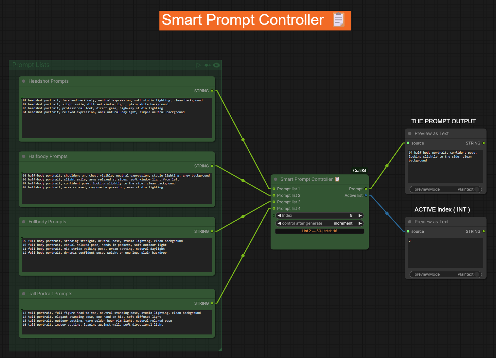
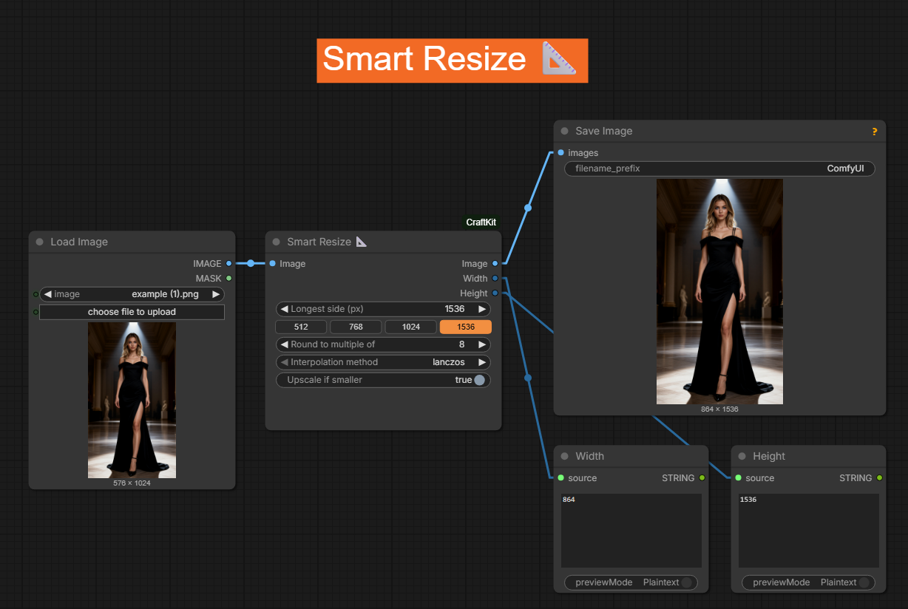
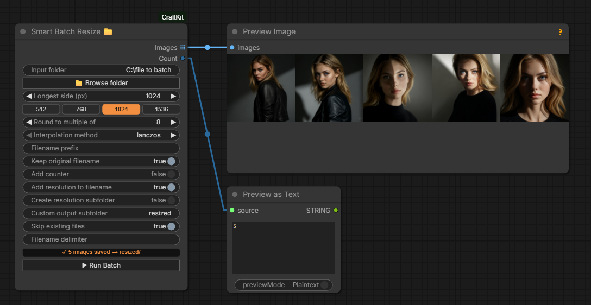
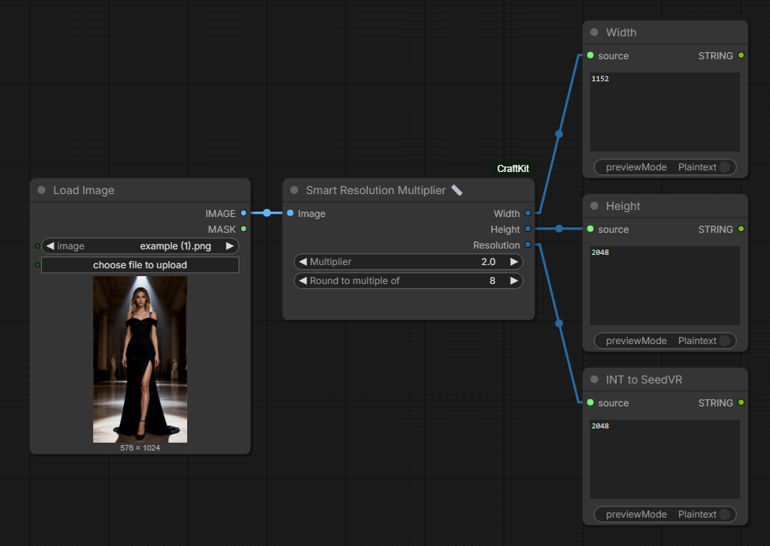

# ComfyUI-CraftKit

Custom nodes for ComfyUI - image resizing, dataset prep & prompt automation for LoRA training workflows.

All nodes appear under the **CraftKit** category in the node menu.

---

## Nodes

### 📋 Smart Prompt Controller
Cycle through up to 4 prompt lists using a single incrementing counter. Counts lines automatically, selects the right prompt, and outputs which list is active - ideal for driving Switch nodes that control aspect ratio, latent size, or other per-category settings.

**Typical usecases:**
- LoRA dataset generation with multiple pose categories (headshots, halfbody, fullbody, tall portrait), each with their own prompt list and aspect ratio
- Any batch workflow where you need to rotate through different prompt sets and switch settings per set

| Input | Type | Description |
|---|---|---|
| counter | INT | Auto-incrementing counter (1-indexed) |
| prompt_list_1 | STRING | First prompt list - one prompt per line (forceInput) |
| prompt_list_2 | STRING | Second prompt list (optional, forceInput) |
| prompt_list_3 | STRING | Third prompt list (optional, forceInput) |
| prompt_list_4 | STRING | Fourth prompt list (optional, forceInput) |

**Outputs:** `prompt` (selected line as STRING), `list_index` (active list number as INT → feed to Switch nodes)

The node displays a status label showing the current position: `List 1 — 4/5 | total: 8`



---

### 📐 Smart Resize
Resize any image (or batch) so the **longest side** equals `longest_side`, with aspect ratio preserved.

Use this as a **pipeline node** — IMAGE in, IMAGE out. No files are saved to disk.

**Typical usecases:**
- Downscale a SeedVR (or other upscaler) result back to your target training size — the upscaler adds fine detail, Smart Resize brings it to the right dimensions for LoRA training
- Any workflow step that needs a clean resize before the next node
- Normalize mixed-resolution batches to a consistent size

| Input | Type | Default | Description |
|---|---|---|---|
| image | IMAGE | — | Single image or batch |
| longest_side | INT | 1536 | Target size for longest side (quick presets: 512 / 768 / 1024 / 1536) |
| multiple_of | INT | 8 | Snap dimensions to this multiple (8 = SD/Flux compatible) |
| interpolation | ENUM | lanczos | lanczos / bicubic / bilinear / nearest |
| upscale_if_smaller | BOOLEAN | false | Also upscale images already smaller than longest_side |

**Outputs:** `image`, `width`, `height`



---

### 📁 Smart Batch Resize
Load **all images from a folder**, resize each one by longest side, and save into a subfolder. Original filenames are always preserved — the node adds an optional suffix and/or resolution to the filename.

Use this for **bulk preprocessing** — e.g. preparing a LoRA dataset from a folder of high-res images.

Includes a **Browse folder** button to pick the input folder directly from the node, and quick presets (512 / 768 / 1024 / 1536) for the longest side.

| Input | Type | Default | Description |
|---|---|---|---|
| input_folder | STRING | — | Source folder path (use Browse button or paste manually) |
| longest_side | INT | 1024 | Target size for longest side |
| multiple_of | INT | 8 | Snap dimensions to this multiple |
| interpolation | ENUM | lanczos | lanczos / bicubic / bilinear / nearest |
| suffix_resolution | BOOLEAN | true | Append resolution to filename — e.g. `photo_1024.png` |
| suffix_custom | STRING | — | Custom text added after filename — e.g. `photo_headshot.png` |
| folder_resolution | BOOLEAN | false | Append resolution to subfolder name — e.g. `resized_1024` |
| folder_custom | STRING | resized | Subfolder name inside the input folder |
| skip_if_exists | BOOLEAN | true | Skip files that already exist in the output folder |
| delimiter | STRING | _ | Separator between filename parts |

**Outputs:** `images` (list), `count`



---

### 📏 Smart Resolution Multiplier
Multiply image dimensions by a factor and output the results as integers.

SeedVR takes a single `resolution` INT (the longest side) — not a width and height separately. Standard math nodes give you a FLOAT or require multiple steps to get there. This node does it cleanly in one step: give it your image and a multiplier, and it outputs `width`, `height`, and `resolution` (longest side) ready to connect directly to SeedVR's `max_resolution` input.

Also useful for LoRA dataset prep — using mixed resolutions in your training set generally produces better results than training on a single fixed size. Smart Resolution Multiplier makes it easy to dynamically calculate the right target size per image rather than hardcoding a value.

| Input | Type | Default | Description |
|---|---|---|---|
| image | IMAGE | — | Source image |
| multiplier | FLOAT | 2.0 | Multiply width and height by this factor |
| multiple_of | INT | 8 | Snap dimensions to this multiple |

**Outputs:** `width`, `height`, `resolution` (longest side as INT → directly into SeedVR)



---

## Why these nodes?

- ComfyUI's built-in `Resize Images by Longer Edge` [BETA] has no Lanczos and no `multiple_of` snapping
- `JWImageResizeByLongerSide` (comfyui-various) has no Lanczos in the official release
- No existing node combines batch folder loading + longest-side resize + original filename preservation
- No existing node outputs a ready-to-use `resolution` INT for SeedVR
- No existing node cycles through multiple prompt lists with automatic list switching and counter

---

## Installation

**ComfyUI Manager:** search for `ComfyUI-CraftKit` and install.

**Manual:**
```bash
cd ComfyUI/custom_nodes
git clone https://github.com/CraftopiaStudio/ComfyUI-CraftKit
```
Restart ComfyUI. All nodes appear under **CraftKit** in the node menu:

- `CraftKit` → **Smart Prompt Controller 📋**
- `CraftKit` → **Smart Resize 📐**
- `CraftKit` → **Smart Batch Resize 📁**
- `CraftKit` → **Smart Resolution Multiplier 📏**

---

## Requirements
Pillow, NumPy, PyTorch — all included with ComfyUI. No extra dependencies.
