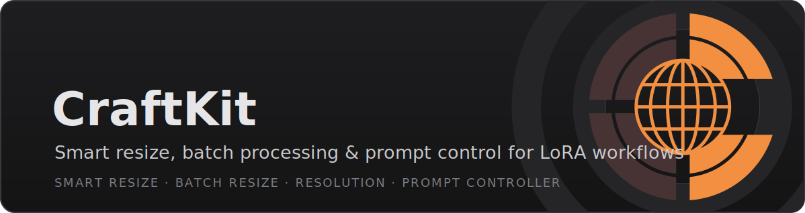
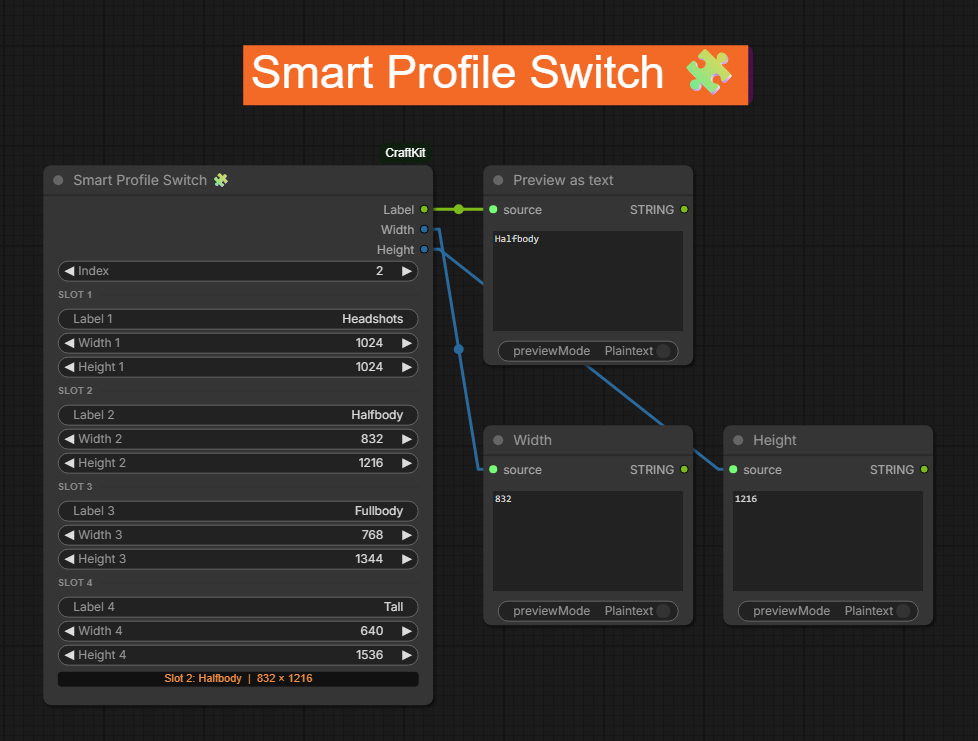

# ComfyUI-CraftKit

Custom nodes for ComfyUI - image resizing, dataset prep & prompt automation for LoRA training workflows.

All nodes appear under the **CraftKit** category in the node menu.

---

## Nodes

### 📋 Smart Prompt Controller


Cycle through up to 4 prompt lists using a single incrementing index. Counts lines automatically, selects the right prompt, and outputs which list is active - ideal for driving Switch nodes that control aspect ratio, latent size, or other per-category settings.

**Typical usecases:**
- LoRA dataset generation with multiple pose categories (headshots, halfbody, fullbody, tall portrait), each with their own prompt list and aspect ratio
- Any batch workflow where you need to rotate through different prompt sets and switch settings per set

| Input | Type | Description |
|---|---|---|
| Index | INT | Current position across all lists (1-indexed). Set "control after generate" to `increment` to auto-advance every run |
| Prompt list 1 | STRING | First prompt list, one prompt per line |
| Prompt list 2 | STRING | Second prompt list (optional) |
| Prompt list 3 | STRING | Third prompt list (optional) |
| Prompt list 4 | STRING | Fourth prompt list (optional) |

**Outputs:** Prompt (selected line as STRING), Active list (active list number as INT → feed to Smart Profile Switch or Switch nodes)

The node displays a status label showing the current position: `List 1 — 4/5 | total: 8`

---

### 🧩 Smart Profile Switch



Maps an active index (1–4) to a label, width, and height. Pairs directly with Smart Prompt Controller's `active_list` output to switch resolution and filename label per category in one node — no separate Aspect Ratio + Primitive + Switch combo needed.

**Typical usecases:**
- Driving `EmptyLatentImage` / `EmptySD3LatentImage` width/height per prompt category
- Feeding a filename suffix into `SaveImageExtended` or similar so each category's output is labeled automatically
- Replacing a CR Aspect Ratio + 4× Primitive + LatentSwitch chain with a single node

| Input | Type | Default | Description |
|---|---|---|---|
| Index | INT | 1 | Active profile (1–4). Connect to Active list from Smart Prompt Controller |
| Label 1 … Label 4 | STRING | Headshots / Halfbody / Fullbody / Tall | Label for each profile, used as filename suffix |
| Width 1 … Width 4 | INT | 1024 / 832 / 768 / 640 | Width for each profile |
| Height 1 … Height 4 | INT | 1024 / 1216 / 1344 / 1536 | Height for each profile |

**Outputs:** Label (STRING), Width (INT), Height (INT)

The node displays a status label showing the active slot: `Slot 2: Halfbody | 832 × 1216`

---

### 📐 Smart Resize


Resize any image (or batch) so the **longest side** equals `longest_side`, with aspect ratio preserved.

Use this as a **pipeline node** — IMAGE in, IMAGE out. No files are saved to disk.

**Typical usecases:**
- Downscale a SeedVR2 (or other upscaler) result back to your target training size — the upscaler adds fine detail, Smart Resize brings it to the right dimensions for LoRA training
- Any workflow step that needs a clean resize before the next node
- Normalize mixed-resolution batches to a consistent size

| Input | Type | Default | Description |
|---|---|---|---|
| Image | IMAGE | — | Single image or batch |
| Longest side (px) | INT | 1536 | Target size for longest side. Quick presets: 512 / 768 / 1024 / 1536 — or type any custom value directly into the field |
| Round to multiple of | INT | 8 | Snap dimensions to this multiple (8 = SD/Flux compatible) |
| Interpolation method | ENUM | lanczos | lanczos / bicubic / bilinear / nearest |
| Upscale if smaller | BOOLEAN | true | Upscale images smaller than longest_side. Turn off to only ever downscale, never upscale |

**Outputs:** Image, Width, Height

---

### 📁 Smart Batch Resize


Load **all images from a folder**, resize each one by longest side, and save into a subfolder. Build clean dataset filenames from a prefix, the original name, and/or a sequential counter — combined with an optional resolution suffix.

Use this for **bulk preprocessing** — e.g. preparing a LoRA dataset from a folder of high-res images. It works as a **standalone node**: it needs no upstream input and no downstream connection to do its job — drop it on the canvas, point it at a folder, hit **Run Batch**, and it reads, resizes, and saves everything itself. Connecting the `images`/`count` outputs is entirely optional, e.g. for previewing results.

Includes a **Browse folder** button to pick the input folder directly from the node, and quick presets (512 / 768 / 1024 / 1536) for the longest side — or type any custom value directly into the field.

| Input | Type | Default | Description |
|---|---|---|---|
| Input folder | STRING | — | Source folder path (use Browse button or paste manually) |
| Longest side (px) | INT | 1024 | Target size for longest side. Quick presets: 512 / 768 / 1024 / 1536 — or type any custom value directly into the field |
| Round to multiple of | INT | 8 | Snap dimensions to this multiple |
| Interpolation method | ENUM | lanczos | lanczos / bicubic / bilinear / nearest |
| Filename prefix | STRING | — | Label prepended to filename — e.g. `headshot` → `headshot_photo_001_1024.jpg` |
| Keep original filename | BOOLEAN | true | Include the original filename in the output name |
| Add counter | BOOLEAN | false | Add a sequential 3-digit counter to each filename (001, 002, ...) |
| Counter start | INT | 1 | Starting number for the counter |
| Add resolution to filename | BOOLEAN | true | Append resolution to filename — e.g. `photo_1024.png` |
| Create resolution subfolder | BOOLEAN | false | Append resolution to subfolder name — e.g. `resized_1024` |
| Custom output subfolder | STRING | resized | Subfolder name inside the input folder |
| Skip existing files | BOOLEAN | true | Skip files that already exist in the output folder |
| Filename delimiter | STRING | _ | Separator between filename parts |

**Outputs:** Images (list), Count

---

### 📏 Smart Resolution Multiplier


Multiply image dimensions by a factor and output the results as integers.

SeedVR2 takes a single `resolution` INT (the longest side) — not a width and height separately. Standard math nodes give you a FLOAT or require multiple steps to get there. This node does it cleanly in one step: give it your image and a multiplier, and it outputs `width`, `height`, and `resolution` (longest side) ready to connect directly to SeedVR2's `resolution` input.

Also useful for LoRA dataset prep — using mixed resolutions in your training set generally produces better results than training on a single fixed size. Smart Resolution Multiplier makes it easy to dynamically calculate the right target size per image rather than hardcoding a value.

| Input | Type | Default | Description |
|---|---|---|---|
| Image | IMAGE | — | Source image — its current width/height are read directly, no separate Get Image Size node needed |
| Multiplier | FLOAT | 2.0 | Multiply width and height by this factor |
| Round to multiple of | INT | 8 | Snap dimensions to this multiple |

**Outputs:** Width, Height, Resolution (longest side as INT → directly into SeedVR2)

---

## Example workflows

Ready-to-load workflows are included in [`example_workflows/`](example_workflows):

- **`smart_prompt_controller_demo.json`** — Smart Prompt Controller + Smart Profile Switch driving 4 prompt categories with auto-switching resolution and filename label
- **`seedvr2_smartresize_demo.json`** — Smart Resolution Multiplier → SeedVR2 upscale → Smart Resize, a clean pattern for upscaling without hardcoding target resolution
- **`smart_batch_resize_demo.json`** — minimal Smart Batch Resize setup with a Note explaining outputs and settings

---

## Why these nodes?

- ComfyUI's built-in `Resize Images by Longer Edge` [BETA] has no Lanczos and no `multiple_of` snapping
- `JWImageResizeByLongerSide` (comfyui-various) has no Lanczos in the official release
- No existing node combines batch folder loading + longest-side resize + original filename preservation
- No existing node outputs a ready-to-use `resolution` INT for SeedVR2
- No existing node cycles through multiple prompt lists with automatic list switching and an index
- No existing node switches label + width + height together per category in one place
- Smart Prompt Controller + Smart Profile Switch handle **uneven category sizes automatically** — 5 headshot prompts and 10 fullbody prompts cycle correctly without padding lists to match or manually tracking where one category ends and the next begins

---

## Installation

**ComfyUI Manager:** search for `ComfyUI-CraftKit` and install.

**Manual:**
```bash
cd ComfyUI/custom_nodes
git clone https://github.com/CraftopiaStudio/ComfyUI-CraftKit
```
Restart ComfyUI. All nodes appear under **CraftKit** in the node menu:

- `CraftKit` → **Smart Prompt Controller 📋**
- `CraftKit` → **Smart Profile Switch 🧩**
- `CraftKit` → **Smart Resize 📐**
- `CraftKit` → **Smart Batch Resize 📁**
- `CraftKit` → **Smart Resolution Multiplier 📏**

---

## Requirements
Pillow, NumPy, PyTorch — all included with ComfyUI. No extra dependencies.
